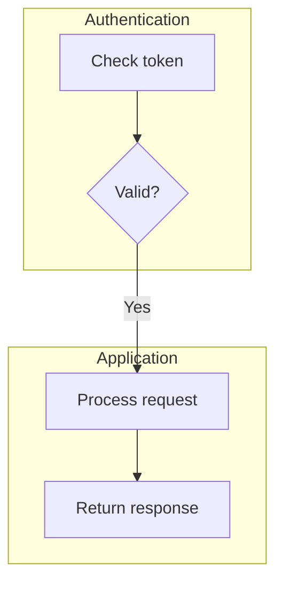
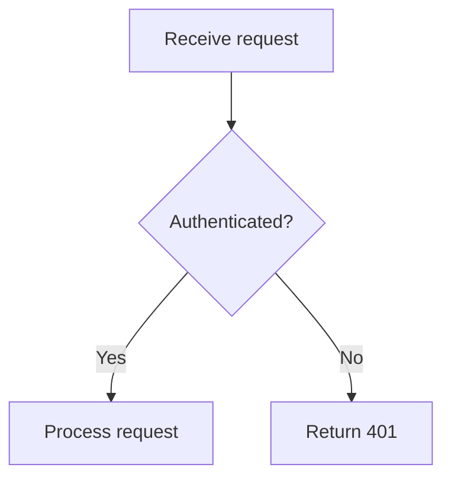
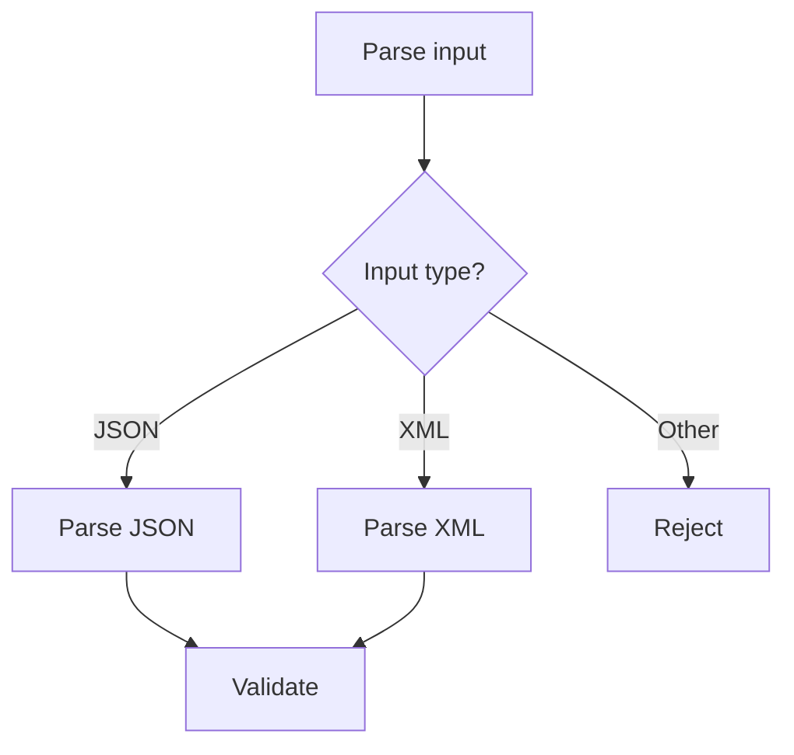
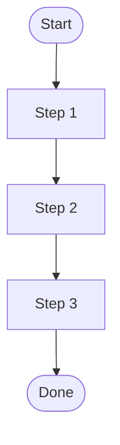
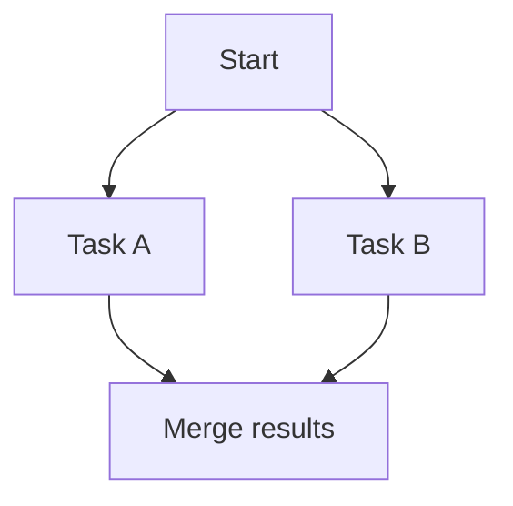
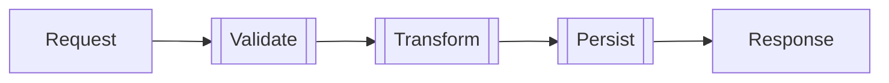

# Flowchart Diagram Lens

Use this lens when the triage step selects **flowchart**.

## Directive

- `flowchart TD` — top-down (default; best for step-by-step processes).
- `flowchart LR` — left-to-right (best for pipelines or timelines).

Use `TD` unless the flow is clearly horizontal in nature.

## Node Shapes

| Syntax      | Shape             | Typical use                |
| ----------- | ----------------- | -------------------------- |
| `A[Text]`   | Rectangle         | Action / step              |
| `A(Text)`   | Rounded rectangle | Start / end                |
| `A{Text}`   | Diamond           | Decision / condition       |
| `A([Text])` | Stadium           | Terminal / event           |
| `A[[Text]]` | Subroutine        | Subprocess / external call |
| `A((Text))` | Circle            | Connector / junction       |

Keep node IDs short (`A`, `B`, `C` or meaningful abbreviations). Put readable text inside the shape brackets.

## Edge Syntax

| Syntax             | Style                    |
| ------------------ | ------------------------ |
| `A --> B`          | Solid arrow              |
| `A --- B`          | Solid line (no arrow)    |
| `A -.-> B`         | Dotted arrow             |
| `A ==> B`          | Thick arrow              |
| `A -->\|label\| B` | Arrow with label         |
| `A --label--> B`   | Alternative label syntax |

Prefer `-->` for normal flow. Use `-.->` for optional or async paths. Use `==>` sparingly for emphasis.

## Subgraphs

Use subgraphs to group related steps. Do not nest subgraphs more than one level deep.

## Decision Diamond Patterns

### Simple if/else

### Multi-branch

## Common Patterns

### Linear flow

### Parallel merge

### Subprocess grouping

## Flowchart Validation Checklist

- Every node ID used in an edge is defined somewhere in the diagram.
- Decision diamonds have labeled edges for each branch.
- Subgraphs have quoted titles when they contain spaces.
- No orphan nodes (every node connects to at least one edge).
- Direction (`TD`/`LR`) matches the natural reading order of the flow.
- The diagram still reads after removing any decorative subgraph or styling.

For full syntax details, see [../references/flowchart-syntax.md](../references/flowchart-syntax.md).
