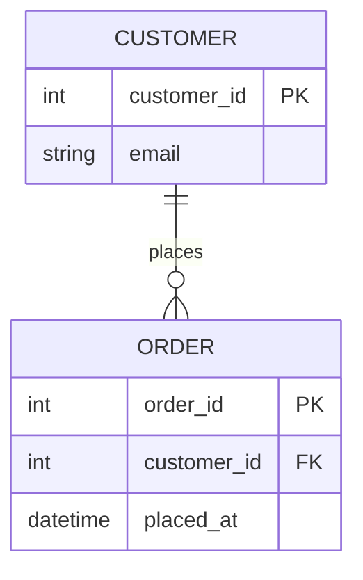
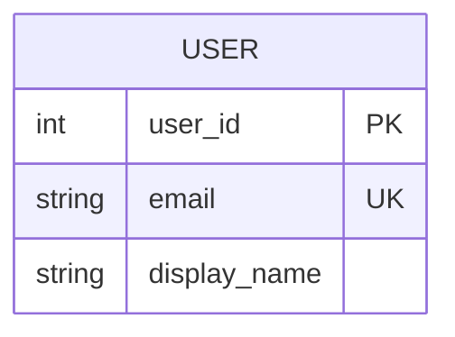

# Mermaid ERD Syntax Reference

Use this file when the user wants an entity relationship diagram, schema map, table relationship view, or a compact data model.

## Core Skeleton



## Relationship Statement

A relationship line follows this shape:

```text
ENTITY_A <left-cardinality><connector><right-cardinality> ENTITY_B : label
```

Examples:

- `USER ||--o{ SESSION : creates`
- `ORDER ||--|{ LINE_ITEM : contains`
- `PRODUCT }o..o{ TAG : tagged_with`

## Cardinality Tokens

| Meaning      | Left side | Right side |
| ------------ | --------- | ---------- | --- | --- | --- | --- |
| Exactly one  | `         |            | `   | `   |     | `   |
| Zero or one  | `         | o`         | `o  | `   |
| One or more  | `}        | `          | `   | {`  |
| Zero or more | `}o`      | `o{`       |

The token closest to each entity describes the optionality/cardinality on that side.

## Connectors

| Syntax | Meaning                               |
| ------ | ------------------------------------- |
| `--`   | Identifying / strong relationship     |
| `..`   | Non-identifying / looser relationship |

Use `--` by default. Use `..` only when that distinction matters to the reader.

## Attributes



- Attribute lines are `type name` with optional key markers at the end.
- Types are free-form Mermaid text, not enforced SQL types.
- Common key markers are `PK`, `FK`, and `UK`.
- Keep attribute names short and recognizable.

## Practical Constraints

- Prefer one conceptual ERD over a verbatim database dump.
- Show junction tables explicitly when many-to-many structure matters.
- Keep relationship labels to a few words.
- Split the diagram if the schema has multiple unrelated domains.
- Mermaid ERDs are best for conceptual structure, not every storage-engine detail.
