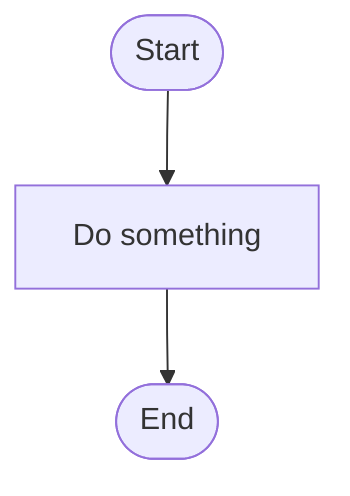
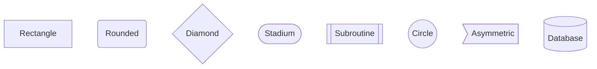
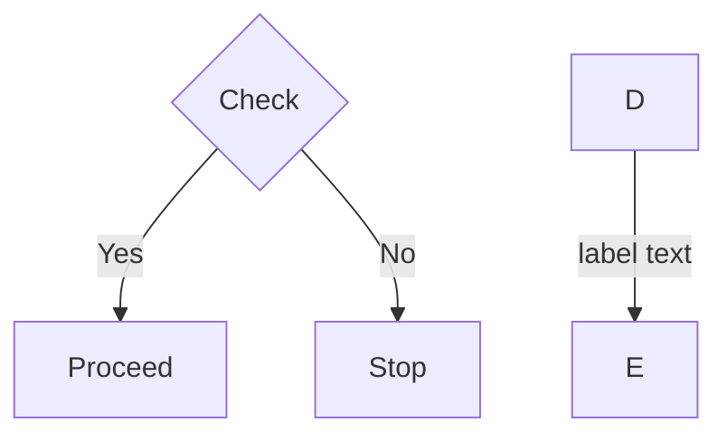
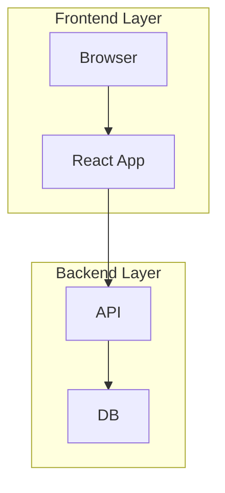
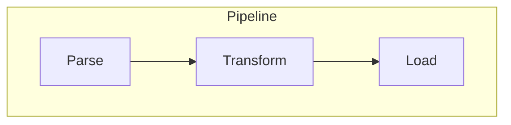
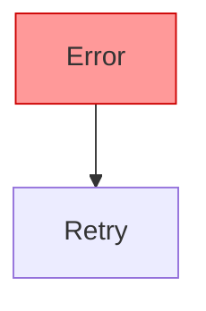
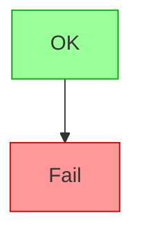
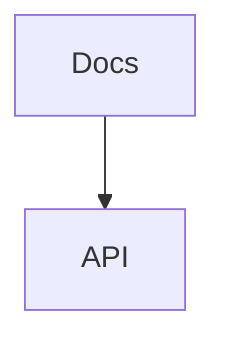

# Mermaid Flowchart Syntax Reference

Use this file when the diagram needs more than basic nodes and arrows.

## Core Skeleton

## Direction Keywords

| Keyword     | Direction     |
| ----------- | ------------- |
| `TD` / `TB` | Top to bottom |
| `LR`        | Left to right |
| `RL`        | Right to left |
| `BT`        | Bottom to top |

Prefer `TD` for process flows and `LR` for pipelines or timelines.

## Node Shapes

| Syntax     | Shape               | Typical use                |
| ---------- | ------------------- | -------------------------- |
| `[Text]`   | Rectangle           | Action / step              |
| `(Text)`   | Rounded rectangle   | Start / end                |
| `{Text}`   | Diamond             | Decision / condition       |
| `([Text])` | Stadium             | Terminal / event           |
| `[[Text]]` | Subroutine          | Subprocess / external call |
| `((Text))` | Circle              | Connector / junction       |
| `>Text]`   | Asymmetric          | Flag / signal              |
| `[(Text)]` | Cylinder / database | Data store                 |

## Edge Types

### Without labels

| Syntax | Style                 |
| ------ | --------------------- |
| `-->`  | Solid arrow           |
| `---`  | Solid line (no arrow) |
| `-.->` | Dotted arrow          |
| `-.-`  | Dotted line           |
| `==>`  | Thick arrow           |
| `===`  | Thick line            |

### With labels

Both `-->|label|` and `--label-->` forms work. Pick one and stay consistent within a diagram.

## Subgraphs

- Quote subgraph titles that contain spaces.
- Subgraphs can be nested, but avoid nesting deeper than one level.
- Edges can cross subgraph boundaries.

### Subgraph direction

Use `direction` inside a subgraph to override the parent chart direction.

## Styling

### Inline styles

### Class definitions

Use styling sparingly — only when visual distinction carries meaning (e.g., error vs success paths).

## Click / Links

Avoid `click` with `callback` — it depends on the hosting environment and is fragile across renderers.

## Practical Constraints

- Keep node IDs short. Put readable text inside shape brackets.
- Keep edge labels to 2-4 words.
- Avoid more than ~15 nodes in a single diagram. Split into multiple charts instead.
- Diamond decisions should have exactly one edge per branch, each labeled.
- Stick to standard Mermaid flowchart syntax for better renderer compatibility.
- Test with `flowchart` directive, not the older `graph` alias, for access to newer features.
