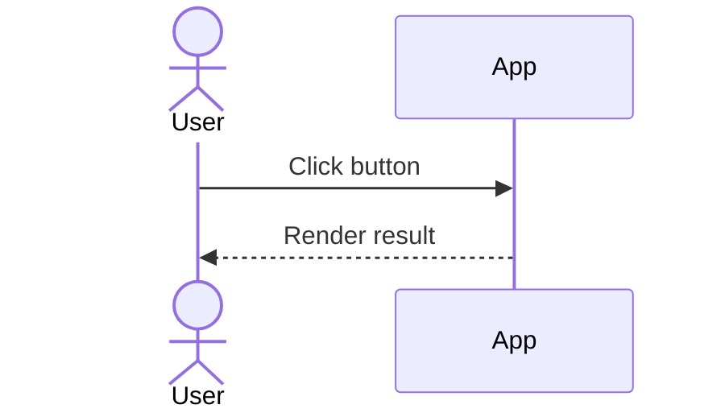
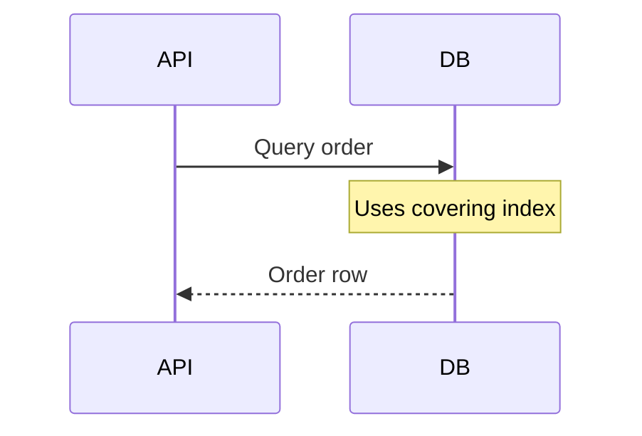
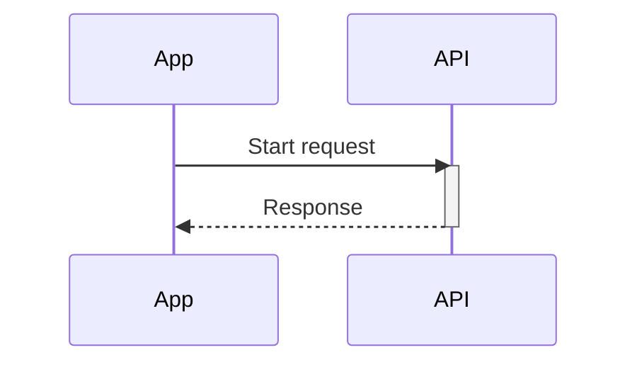
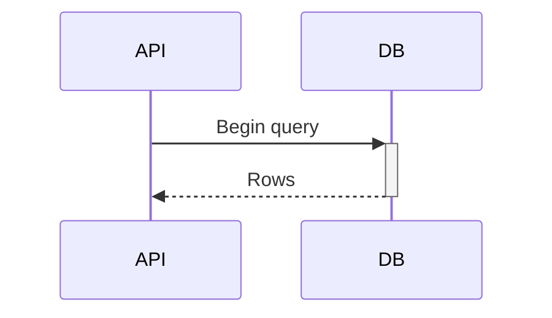
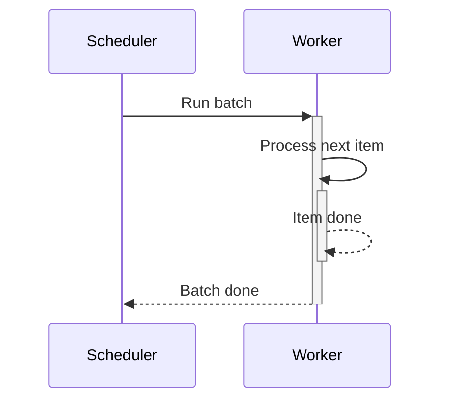
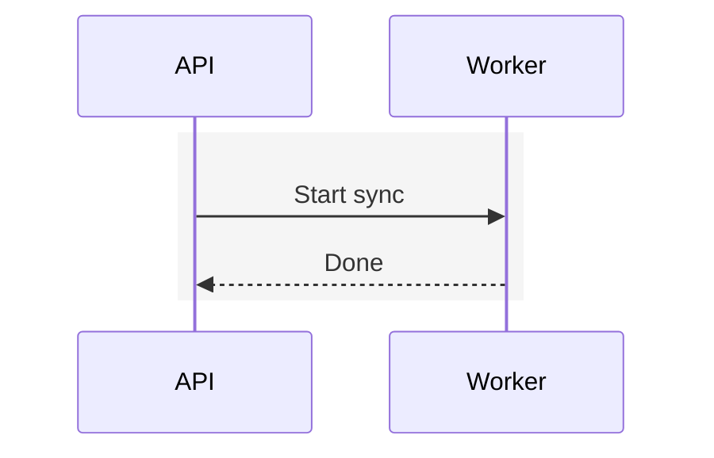

# Mermaid Sequence Syntax Reference

Use this file when the diagram needs more than a basic linear flow.

## Core Skeleton



## Participants

- `actor User`
- `participant API`
- `participant DB as Orders DB`

Declare participants near the top when clarity matters. Inline creation is legal in some renderers, but explicit declarations are easier to control.

## Arrow Styles

- `->>`: message/request
- `-->>`: return/response
- `-x`: stop or failed delivery
- `--x`: failed return or terminated response

Prefer `->>` and `-->>` unless a failure marker makes the diagram materially clearer.

## Notes



Supported note forms:

- `Note over API: ...`
- `Note over API,DB: ...`
- `Note right of API: ...`
- `Note left of API: ...`

## Control Flow

### alt / else

```mermaid
alt payment approved
    API-->>App: Success
else payment declined
    API-->>App: Declined
end
```

### opt

```mermaid
opt user enabled email updates
    API->>Email: Send receipt
end
```

### loop

```mermaid
loop retry up to 3 times
    Worker->>API: Retry request
end
```

### par / and

```mermaid
par fetch profile
    App->>Profile: Get profile
and fetch settings
    App->>Settings: Get settings
end
```

Use `par` only when simultaneous work is part of the point. If not, keep the diagram sequential.

### critical / option

```mermaid
critical publish exactly once
    Worker->>Outbox: Claim message
option message already claimed
    Outbox-->>Worker: Skip
end
```

Use this sparingly. `alt` is more familiar and often good enough.

## Activation

Mermaid supports both explicit activation statements and shorthand activation markers on arrows.

### Explicit `activate` / `deactivate`



Use explicit statements when the activation lifetime is important but the `+` / `-` arrow suffixes would make a dense sequence harder to scan.

### Arrow suffix shorthand



### Stacked activations



Activation bars can help for nested calls, but they add visual noise. Skip them unless call duration or nesting matters.

## Background Highlighting



Use `rect` only to group a phase. Do not use it as decoration.

## Practical Constraints

- Keep participant names short.
- Keep message labels action-oriented.
- Avoid very deep nesting.
- Prefer two diagrams over one overloaded diagram.
- Stick to standard Mermaid sequence syntax for better renderer compatibility.
