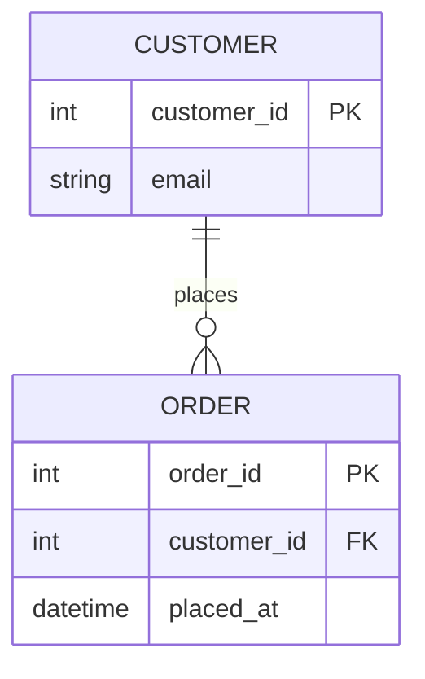
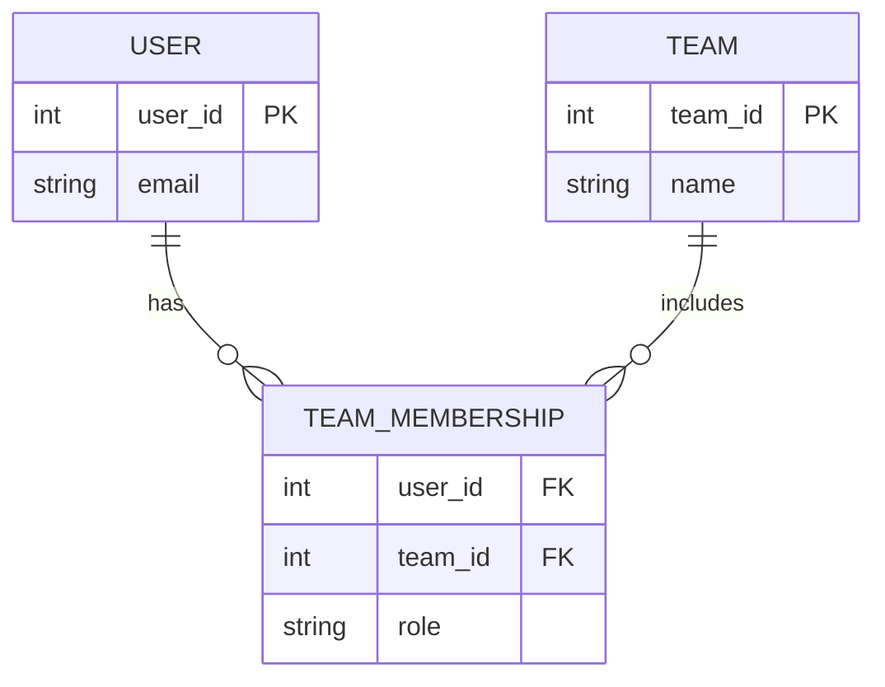

# ERD Lens

Use this lens when the triage step selects **erd**.

## Directive

Start with `erDiagram`.

## Modeling Focus

- Model entities first, then add only the relationships needed to explain the schema.
- Prefer stable entity names. Uppercase table-like names work well, but consistency matters more than style.
- Keep relationship labels short and verb-based: `places`, `contains`, `belongs_to`.
- Include attributes only when they help the reader. Do not dump every column by default.
- Use `PK`, `FK`, and `UK` markers only when keys matter to the question.

## Relationship Patterns

| Relationship | Example |
|---|---|
| One to many | `CUSTOMER ||--o{ ORDER : places` |
| One to one | `USER ||--|| PROFILE : has` |
| Many to many | `USER }o--o{ TEAM : joins` |
| Optional to one | `ORDER }o--o| COUPON : uses` |

Use solid `--` relationships by default. Use dotted `..` only when the identifying vs non-identifying distinction matters.

## Common Patterns

### Parent and child

### Join table

## ERD Validation Checklist

- Every relationship uses valid Mermaid ERD cardinality syntax.
- Relationship labels are short and describe the relationship, not the implementation.
- Entity names are consistent everywhere they appear.
- Attribute blocks include only relevant fields and key markers.
- Cardinality matches the intended semantics before finalizing.

For full syntax details, see [../references/erd-syntax.md](../references/erd-syntax.md).
