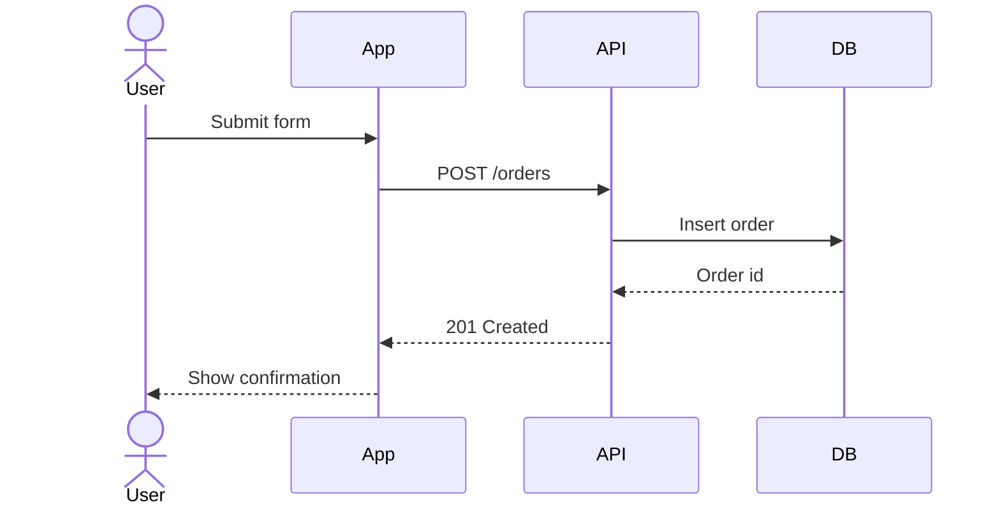
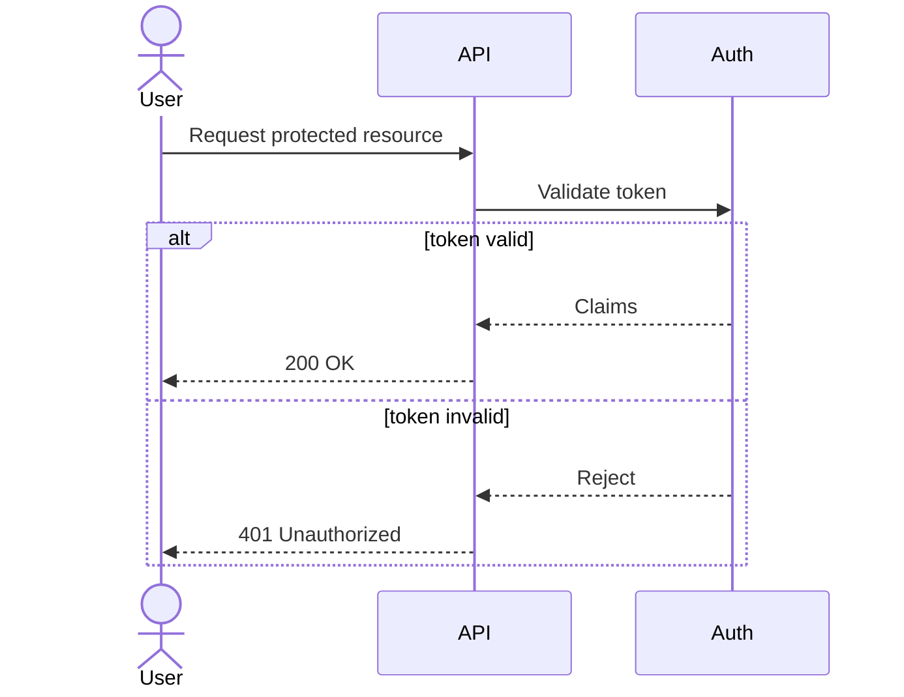
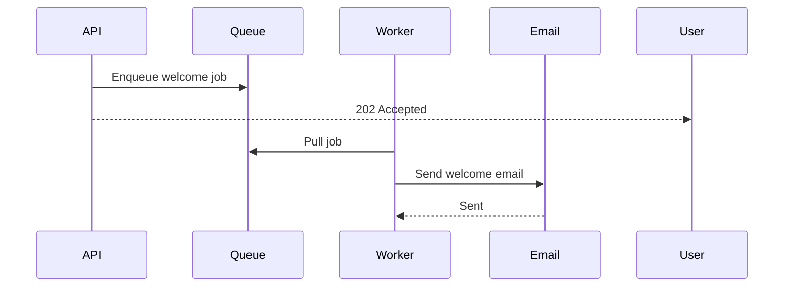

# Sequence Diagram Lens

Use this lens when the triage step selects **sequence**.

## Directive

Start with `sequenceDiagram`.

## Participants

- Use `actor` for humans or external operators, `participant` for systems.
- Declare participants near the top for clarity: `participant API as Payments API`.
- Prefer stable participant names across the whole diagram.
- Keep names short — alias long names.

## Arrow Styles

| Arrow | Meaning |
|---|---|
| `->>` | Message / request |
| `-->>` | Return / response |
| `-x` | Stop or failed delivery |
| `--x` | Failed return or terminated response |

Prefer `->>` and `-->>` unless a failure marker makes the diagram materially clearer.

## Control Flow

- `alt` / `else` — conditional branches. Show failures here instead of burying them in notes.
- `opt` — optional path.
- `loop` — retries or repeated steps.
- `par` / `and` — concurrent work (only when concurrency matters to the explanation).
- `critical` / `option` — exactly-once semantics (use sparingly; `alt` is more familiar).

Use `autonumber` only when step numbering helps discussion or review.

## Common Patterns

### Request and response

### Conditional branch

### Async handoff

## Sequence Validation Checklist

- Every participant is declared or introduced consistently.
- Every `alt`, `opt`, `loop`, `par`, `critical`, or `rect` block has a matching `end`.
- Arrow direction matches the intended sender and receiver.
- Labels are short enough to scan without wrapping badly.
- The diagram still reads after removing any decorative note or branch.

For full syntax details, see [../references/sequence-syntax.md](../references/sequence-syntax.md).
