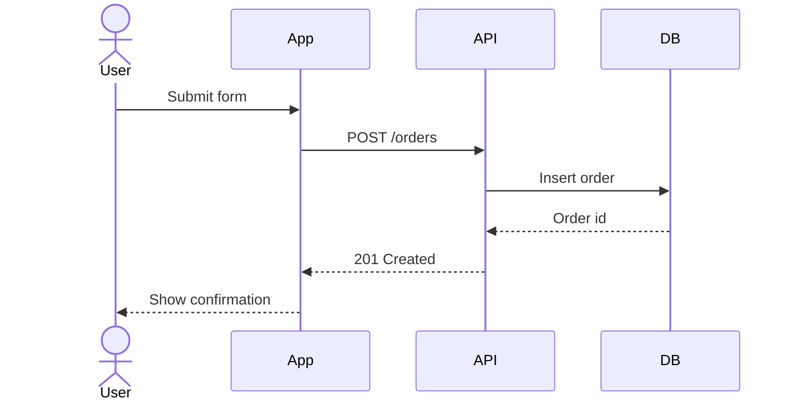
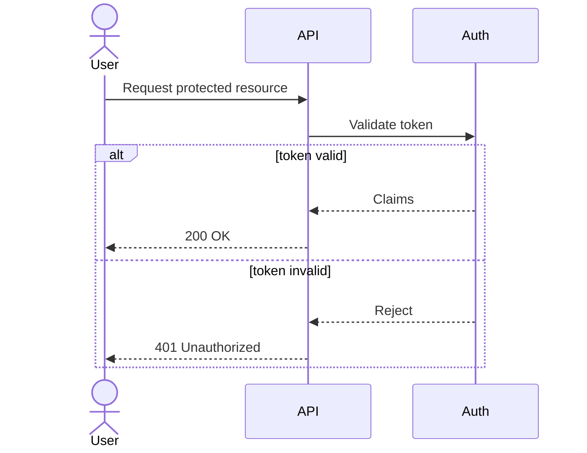
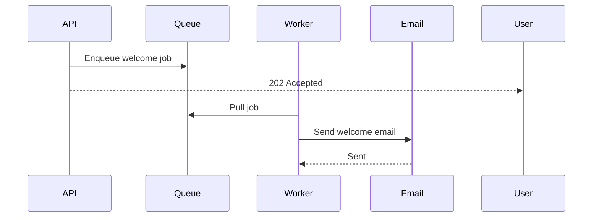

# Mermaid Sequence Diagram

Turn an interaction flow into valid, readable Mermaid sequence diagram code.

Keep the output simple. Prefer the smallest diagram that still explains the behavior.

## Workflow

1. Identify the participants.
2. Put them in left-to-right order that matches how a reader expects to follow the flow.
3. Write the happy path first.
4. Add only the control-flow blocks that materially improve understanding: `alt`, `opt`, `loop`, `par`, `critical`, or notes.
5. Run the validator when local execution is available, then do a final syntax pass to remove invalid or overly clever constructs.

If the source flow is ambiguous, state the assumption before the diagram.

## Output Rules

- Start with `sequenceDiagram`.
- Use short participant labels. Alias long names with `participant API as Payments API`.
- Prefer stable participant names across the whole diagram.
- Keep one message per line.
- Prefer explicit verbs in message labels: `Validate token`, `Persist order`, `Publish event`.
- Use notes sparingly. If a note replaces three or more noisy arrows, it is probably worth it.
- Use `autonumber` only when step numbering helps discussion or review.
- Prefer `actor` for humans or external operators and `participant` for systems.
- Do not encode business logic in message text. Show the interaction, not the whole implementation.
- Avoid renderer-fragile tricks or nonstandard syntax. Use standard Mermaid sequence features only.

## Diagram-Shaping Heuristics

- Collapse incidental infrastructure if it does not affect the decision being explained.
- Split the diagram instead of making one giant chart when there are two unrelated concerns.
- Show failures with `alt` branches instead of burying them in note text.
- Show retries with `loop`.
- Show independent concurrent work with `par` only when concurrency matters to the explanation.
- Prefer duplication over a deeply nested diagram that becomes hard to read.

## Common Patterns

### Request and response

### Conditional branch

### Async handoff

## Validation

Before finalizing:

- If the diagram exists as a local file or can be written to a temp file, run `./scripts/validate.sh <diagram-file>`.
- If the diagram is in Markdown, extract the Mermaid block first or write just the Mermaid snippet to a temp file before validating.
- Check that every participant is declared or introduced consistently.
- Check that every block has a matching `end`.
- Check that arrow direction matches the intended sender and receiver.
- Check that labels are short enough to scan without wrapping badly.
- Check that the diagram still reads after removing any decorative note or branch.

For less common constructs or syntax details, read [references/sequence-syntax.md](./references/sequence-syntax.md).
For wording, escaping, and readability guidance, read [references/best-practices.md](./references/best-practices.md).

## Resources

### scripts/

- `scripts/validate.sh`: validate Mermaid sequence diagram syntax by rendering the diagram with `npx @mermaid-js/mermaid-cli`.
