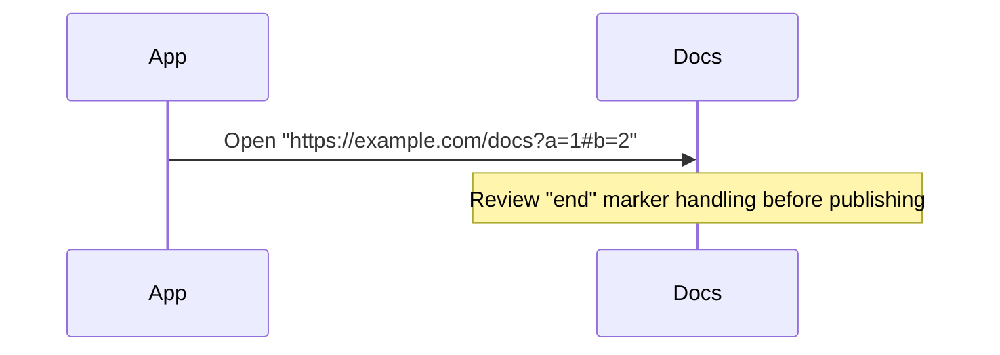

# Mermaid Sequence Diagram Best Practices

Use this file when writing or cleaning up diagrams, especially when labels or notes contain parser-sensitive text.

## Keep the Diagram Boring

- Prefer short participant names and short message labels.
- Show the happy path first, then add `alt`, `opt`, `loop`, or `par` only when they materially help.
- Split one overloaded diagram into two smaller ones when the flow has more than one main concern.

## Keep Text Safe

- Prefer simple message and note text over punctuation-heavy prose.
- If text includes parser-sensitive content, prefer quoting or escaping instead of fighting the parser.
- If the literal word `end` must appear in text, wrap it as `"end"`, `(end)`, `[end]`, or `{end}`.
- Escape parser-sensitive characters with entity codes when needed.
  Examples:
  - `#` as `#35;`
  - `;` as `#59;`

## URLs and Other Special Characters

- Be careful with notes or message text that includes raw URLs, query strings, fragments, or other punctuation-heavy text.
- If a URL or special string makes the diagram fragile, prefer one of these fixes:
  - wrap the problematic text in quotes when that form is accepted by the construct you are using
  - shorten the visible text and move the full URL into surrounding prose
  - escape parser-sensitive characters such as `#` and `;`

Example:

## Readability

- Use aliases for long actor labels.
- Keep one message per line.
- Prefer explicit verbs like `Validate token` or `Persist order`.
- Use notes sparingly. If the note is doing the real work, the flow may need to be simpler.
